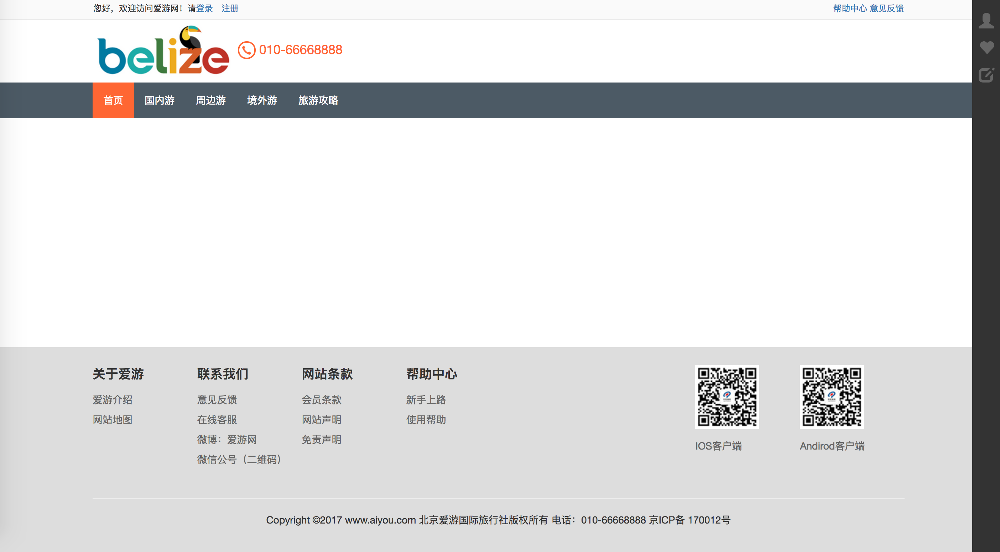

# 1.1-快速上手

按以下步骤，你可以着手开发自己的前端页面。

## 本机环境

- 系统: macos
- 环境: 
    - node    v6.10.3
    - npm     v3.10.10
    - fis3    v3.4.32
    - git     v2.9.3
- IDE:
    - VSCode  v1.13

## 下载本框架

https://github.com/itheima2017/web-fis3-itheima/archive/master.zip

我们解压到 `/home/www/myweb` , `myweb` 就是本次的项目目录.

## 安装 Node 和 NPM

详细过程参考官网 https://nodejs.org

## 安装 FIS3

```bash
npm install -g fis3
```

## 安装依赖

```bash
npm i
```

## 运行

```bash
npm start
```

## 浏览

http://127.0.0.1:8080/dist/pages/


如果一切顺利，你可以看到这个页面，左侧是导航，内置了几个样例页面，如果是小项目，你可以参照了改改。

## 命令行说明

名称 | 说明
-----|--------------
npm start         | 运行并浏览，修改代码后自动编译刷新页面
npm run open      | 打开预览www目录
npm run release   | 编译并更新www目录
npm run clear     | 清空编译临时文件
npm run dist      | 发布release 到目录./release

> 你可以打开 `package.json` 修改 `scripts` 符合你自己的需要，建议你做加法，否则其他人就不知道了。

## 主要目录介绍

```
├── release                 - 通过编译生成的目录
│   ├── dsit                - 真正用来上线的目录
│       ├── css             - 通过编译生成的css文件
│       ├── js              - 通过编译生成的js文件
│       ├── images          - 通过编译压缩后的images文件
│       ├── plugins         - 所有的第三方插件目录
│       ├── pages           - 通过编译生成的页面html
|
├── pages                   - 所有页面目录
│   ├── page1               - 某一页面目录
│       ├── images          - 页面的图片目录
|       ├── page1.json      - 页面的json数据
│       ├── page1.css       - 页面级css
│       ├── page1.js        - 页面级js
│       ├── page1.html      - 页面html
│
├── plugins                 - 所有的第三方插件 如 jquery bootstrap jquery-ui
│
├── modules                 - 所有模块目录
│   ├── ui-modules          - 所有项目中被抽象的UI组件目录
│       ├── ui-module1      - 某一UI组件目录
│           ├── images          - 组件的图片目录
|           ├── ui-module1.json     - 组件的json数据
│           ├── ui-module1.css      - 组件的css
│           ├── ui-module1.js       - 组件的js
│           ├── ui-module1.html     - 组件的html
```

我们工作中用的最多的就是，`pages` `modules\ui-modules` 这两个目录 `页面` 和 `UI组件`

## 分析样例页面 `旅游首页`

打开 `旅游首页` 文件 `/pages/travel-index/travel-index.html`

页面结构如下

```html
<!DOCTYPE html>
<html lang="zh-CN">

...

<body>
  <div class="wrapper">
        <div class="wrapper-content">


      <!-- 页面头部 -->
      <link rel="import" href="../../modules/ui-modules/top-header/top-header.html?__inline">
      <link rel="import" href="../../modules/ui-modules/header/header.html?__inline">
      <div class="travel-index">
        <div class="container">
          <div class="maincontent">
            <!-- 搜索区域 -->
            <link rel="import" href="../../modules/ui-modules/travel-list-city-btn/travel-list-city-btn.html?__inline">
            <link rel="import" href="../../modules/ui-modules/travel-list-search-bar/travel-list-search-bar.html?__inline">

            <div class="clearfix"></div>
            <!-- 调用内容组件 -->
            <div class="navintro">
              <link rel="import" href="../../modules/ui-modules/travel-index-nav/travel-index-nav.html?__inline">
              <link rel="import" href="../../modules/ui-modules/travel-index-imgroll/travel-index-imgroll.html?__inline">
            </div>
            <div class="recommend">
              <link rel="import" href="../../modules/ui-modules/travel-index-recommend/travel-index-recommend1.html?__inline">
              <link rel="import" href="../../modules/ui-modules/travel-index-recommend/travel-index-recommend2.html?__inline">
              <link rel="import" href="../../modules/ui-modules/travel-index-recommend/travel-index-recommend3.html?__inline">
            </div>
            <div style="clear: both"></div>
          </div>
        </div>
      </div>
      <!-- /container -->
    </div>
  </div>
  <!-- 页面底部 -->
  <link rel="import" href="../../modules/ui-modules/footer/footer.html?__inline">
  <!--侧边栏-->
  <link rel="import" href="../../modules/ui-modules/sidebar/sidebar.html?__inline">
  <!-- 页面 css js -->
  <script src="./travel-index.js"></script>
  <link href="./travel-index.scss" rel="stylesheet">

</body>
```

可以发现很多 `<link .../>` 标签

```html
<link rel="import" href="../../modules/ui-modules/travel-list-city-btn/travel-list-city-btn.html?__inline">
```

对了，这就是模块调用，`fis3` 里规定了 `href=...?__inline` 这样的方式就能把内容嵌入编译了.

参考文:[fis3-嵌入资源](http://fis.baidu.com/fis3/docs/user-dev/inline.html)

我们要做的就是合理的抽取组件, 这个在后面的章节会说.

## 创建新页面

在线开始动手写一个页面来体验下 `hello-word` 模块

- 创建目录 `pages\hello-word`

- 创建文件 `pages\hello-word\hello-word.html`

> 复制下上面的代码，稍微修改下
> 去掉 `<script src="./travel-index.js"></script>` 这里用不到
> 修改 `<link href="./hello-word.scss" rel="stylesheet">`
> `.html` `.js` `.scss` 请文件名一致

```html
<!DOCTYPE html>
<html lang="zh-CN">

<head>
  <meta charset="utf-8">
  <meta http-equiv="X-UA-Compatible" content="IE=edge">
  <!-- 上述3个meta标签*必须*放在最前面，任何其他内容都*必须*跟随其后！ -->
  <meta name="description" content="">
  <meta name="author" content="">
  <link rel="icon" href="../../assets/img/favicon.ico">

  <title>爱游网-首页</title>

</head>

<body>
  <div class="wrapper">
        <div class="wrapper-content">


      <!-- 页面头部 -->
      <link rel="import" href="../../modules/ui-modules/top-header/top-header.html?__inline">
      <link rel="import" href="../../modules/ui-modules/header/header.html?__inline">
      <div class="travel-index">
        <div class="container">
          <div class="maincontent">

          </div>
        </div>
      </div>
      <!-- /container -->
    </div>
  </div>
  <!-- 页面底部 -->
  <link rel="import" href="../../modules/ui-modules/footer/footer.html?__inline">
  <!--侧边栏-->
  <link rel="import" href="../../modules/ui-modules/sidebar/sidebar.html?__inline">
  <!-- 页面 css js -->
  <link href="./hello-word.scss" rel="stylesheet">

</body>
```

- 编译运行

```bash
npm run release
```



## 添加新组件


## 查看结果


## 发布文件


